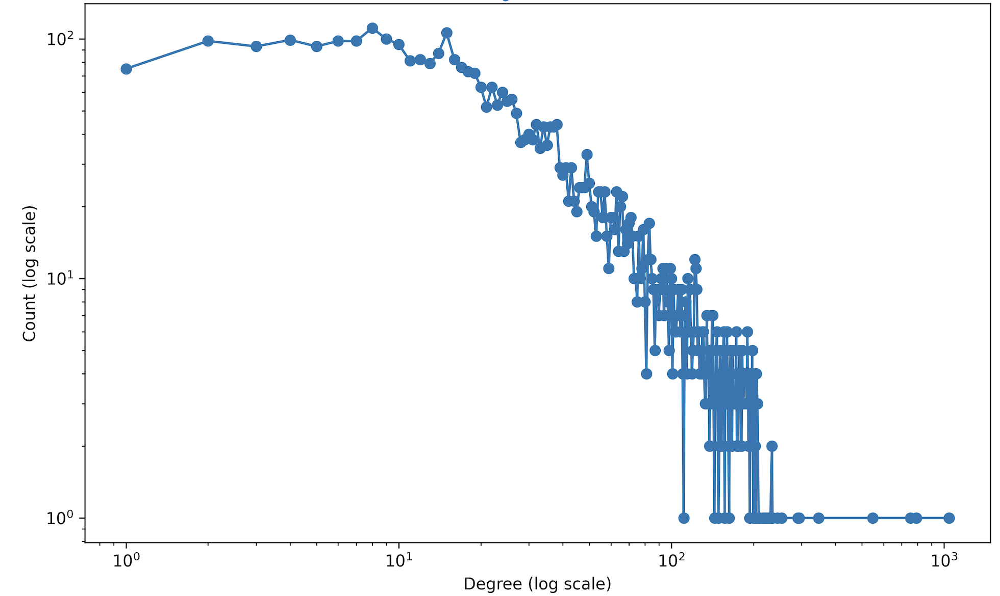
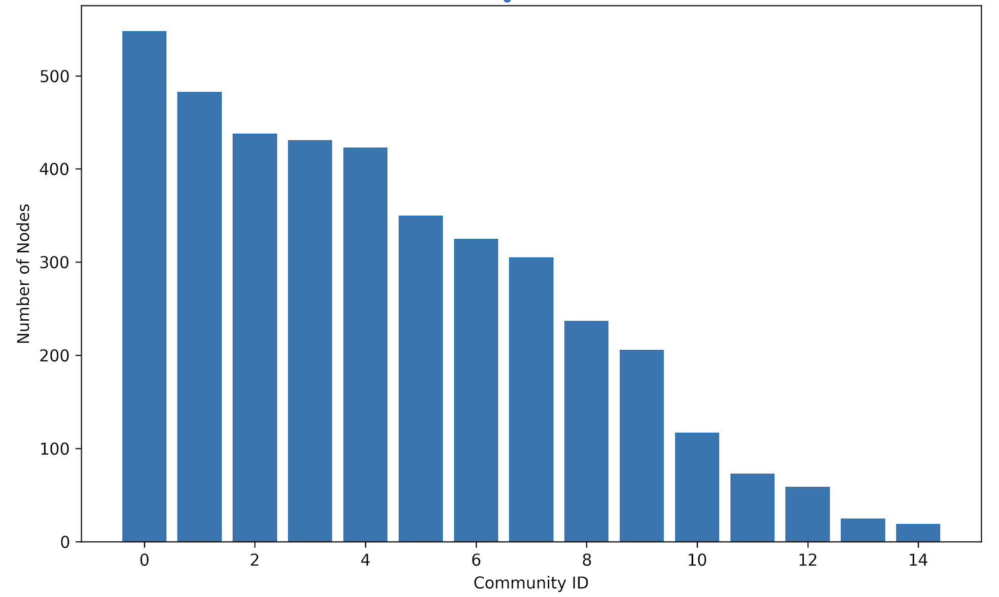
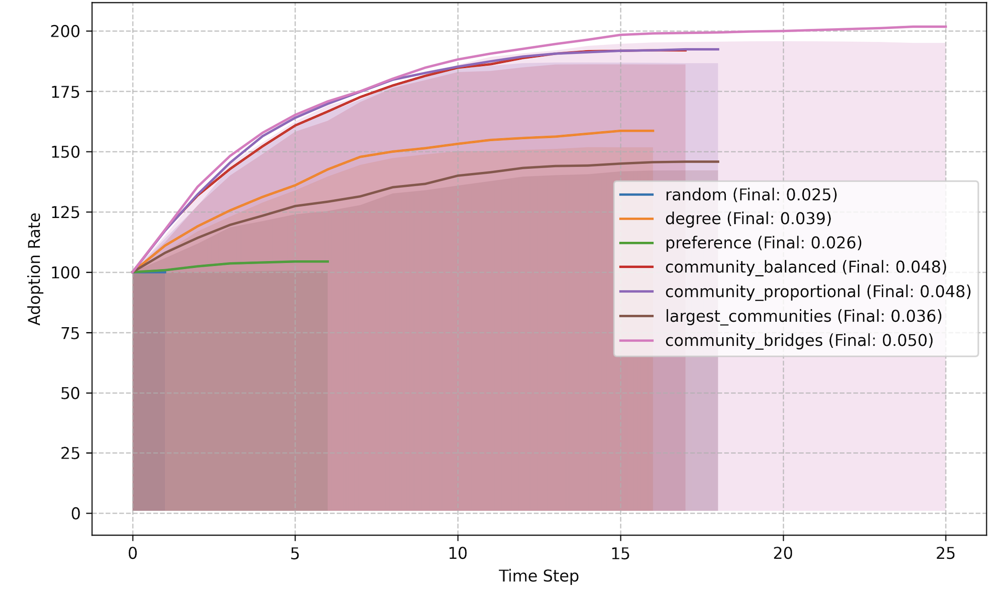
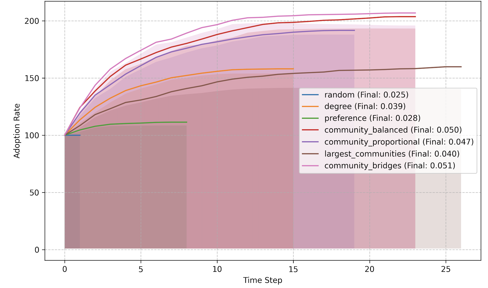
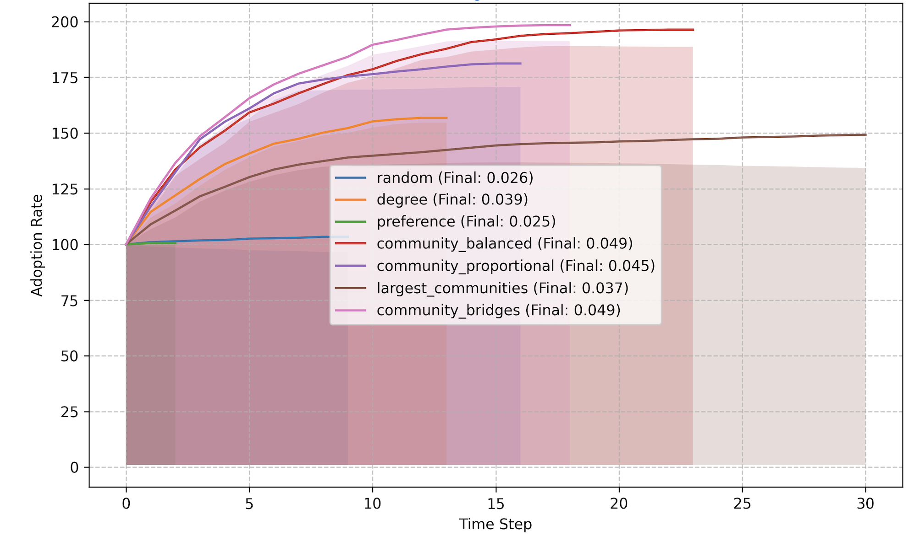
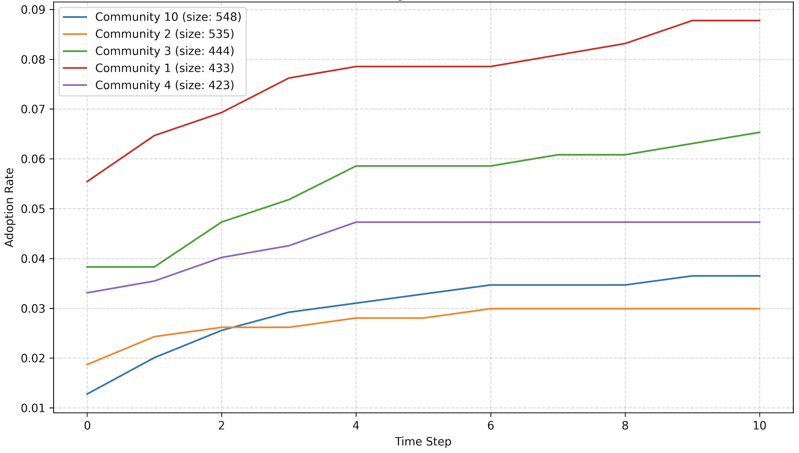
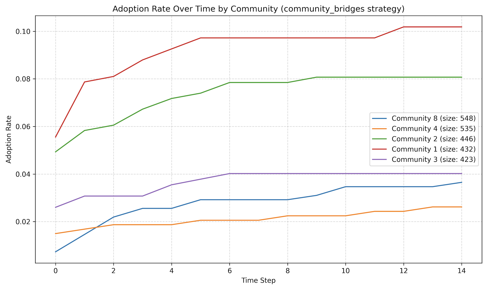
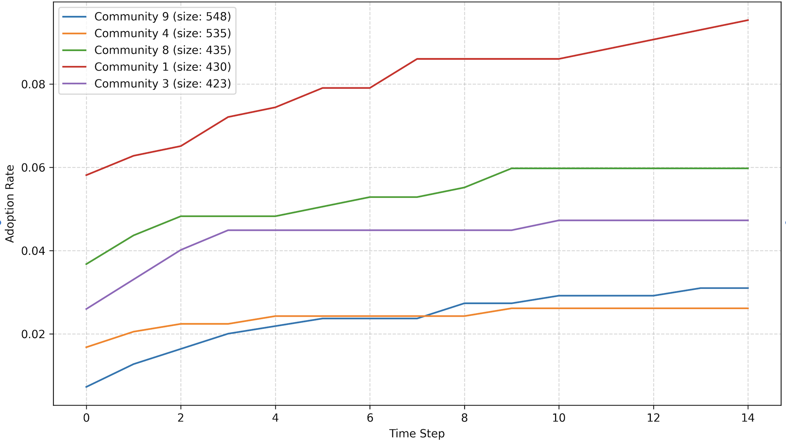

# Movie Promotion Diffusion in Social Networks

> A network science study of how movie promotions spread through social networks with varying levels of preference homophily — comparing 7 seeding strategies across 3 homophily settings using a synthetic multi-layered network built on real social and preference data.

[](https://python.org)
[](https://networkx.org)


---

## Overview

How does a movie recommendation spread through a social network? Does targeting users based on their genre preferences actually work? This project investigates information diffusion dynamics in preference-based social networks through computational simulation.

Using a synthetic multi-layered network that combines the **SNAP Facebook network** structure with **MovieLens** genre preferences, we simulate movie promotion campaigns under three levels of preference homophily (0.3, 0.5, 0.7) and compare seven distinct seeding strategies.

**Key finding:** Network position matters more than individual preferences. Community-bridge targeting achieves up to 2x the adoption rate of preference-based targeting — even in highly homophilic networks.

For the full technical report and dataset card, see:
- [`Network_Science_Report.pdf`](Network_Science_Report.pdf)
- [`Dataset_Card.pdf`](Dataset_Card.pdf)

---

## Research Questions

- How does network structure influence the effectiveness of movie promotion strategies?
- How does preference homophily affect promotion diffusion patterns?
- How do community structures impact the effectiveness of targeted promotions?

---

## Dataset

The dataset is synthetic, constructed by combining two publicly available sources:

| Source | Description | License |
|---|---|---|
| [SNAP Facebook Network](https://snap.stanford.edu/data/ego-Facebook.html) | 4,039 nodes, 88,234 edges — anonymized Facebook friendship connections | CC BY-NC 4.0 |
| [MovieLens 32M](https://grouplens.org/datasets/movielens/) | ~200,000 ratings across 20 movie genres | Non-commercial with attribution |

**Network properties:** Clustering coefficient 0.6, average path length 4.7, diameter 8 — confirming small-world characteristics. Degree distribution follows a power-law (scale-free network).

**Preference layer:** Genre preferences are assigned to each node using a homophily-controlled mixing model — community-level preferences generated via Dirichlet sampling, then blended with individual noise according to the homophily parameter:

```
mixed_preferences = h × community_preferences + (1 - h) × individual_noise
```

Three dataset variants are created with homophily strengths of **0.3** (low), **0.5** (medium), and **0.7** (high).

---

## Project Structure

```
.
├── network_creation.py           # Build the multi-layered network with homophilic preferences
├── network_structural_analysis.py # Centrality, community detection, structural metrics
├── movie_diffusion.py            # Diffusion simulation with 7 seeding strategies
└── diffusion_outcome_analysis.py  # Results analysis and visualisation
```

---

## Methodology

### Network Construction (`network_creation.py`)

1. Loads the SNAP Facebook network as an undirected graph
2. Loads MovieLens genre data to define the preference space (20 genres)
3. Detects communities using the **Louvain algorithm**
4. Assigns homophily-controlled genre preferences to each node
5. Validates homophily by comparing cosine similarity between connected vs. random node pairs
6. Generates synthetic movie ratings based on preference-genre alignment (with Gaussian noise)
7. Saves the network edgelist, user preferences, and synthetic ratings

### Structural Analysis (`network_structural_analysis.py`)

Computes centrality measures (degree, betweenness, eigenvector), community-level properties (internal/external edge ratios, bridge nodes, density), and network-wide metrics (clustering coefficient, average path length, degree distribution).

### Diffusion Simulation (`movie_diffusion.py`)

Implements a **threshold-based diffusion model** combining preference matching and social influence:

```
combined_score = (preference_weight × match_score) + (social_weight × influence_score)

if combined_score ≥ threshold → adopt
```

Default parameters: `preference_weight=0.6`, `social_weight=0.4`, `threshold_mean=0.5`

**Seven seeding strategies tested with 100 seed nodes each:**

| Strategy | Description |
|---|---|
| Random | Baseline — seeds selected uniformly at random |
| Degree | Targets highest-degree nodes (hubs) |
| Preference | Targets nodes with strongest genre preference match |
| Community-Balanced | Distributes seeds equally across all communities |
| Community-Proportional | Allocates seeds proportional to community size |
| Largest Communities | Concentrates seeds in the two largest communities |
| **Community-Bridges** | **Targets nodes that connect different communities** |

Each strategy runs across 5 independent simulations per homophily setting (genres: Action, Comedy, Romance) for up to 30 time steps until convergence.

### Results Analysis (`diffusion_outcome_analysis.py`)

Loads simulation results, generates adoption rate comparisons across strategies, and produces community-level temporal diffusion plots.

---

## Results

### Network Structure

The degree distribution confirms a power-law (scale-free) structure — a small number of highly connected hubs and many low-degree nodes, typical of real social networks.



The Louvain algorithm identified 15 communities with considerable size variation. The two largest communities contain ~550 nodes each, while the smallest have fewer than 20 members.



---

### Strategy Comparison (Final Adoption Rates)

Reading directly from simulation results:

| Strategy | Homophily 0.3 | Homophily 0.5 | Homophily 0.7 |
|---|---|---|---|
| **Community-Bridges** | **5.1%** | **5.0%** | **4.9%** |
| Community-Balanced | 5.0% | 4.8% | 4.9% |
| Community-Proportional | 4.7% | 4.8% | 4.5% |
| Largest Communities | 4.0% | 3.6% | 3.7% |
| Degree | 3.9% | 3.9% | 3.9% |
| Preference | 2.8% | 2.6% | 2.5% |
| Random | 2.5% | 2.5% | 2.6% |

**Diffusion curves — Low homophily (0.3):**



**Diffusion curves — Medium homophily (0.5):**



**Diffusion curves — High homophily (0.7):**



---

### Community-Level Adoption (Community Bridges Strategy)

Community 1 consistently achieves the highest adoption rate regardless of homophily level, confirming its structural dominance in the network.

**Low homophily (0.3):**



**Medium homophily (0.5):**



**High homophily (0.7):**



---

### Key Findings

**Community bridges consistently win.** Targeting nodes that span community boundaries achieves the highest adoption rates across all homophily settings — roughly double that of preference-based targeting.

**Preference-based targeting fails.** Despite marketing intuition, targeting users with the strongest genre preferences performs poorly even in high-homophily networks (2.5–2.8% adoption). Network position outweighs individual preference in determining promotion effectiveness.

**Homophily amplifies strategy differences.** As homophily increases, the performance gap between community-based and simpler strategies widens — high preference similarity makes community boundaries more important, not less.

**Community 1 is structurally dominant.** Regardless of homophily level or seeding strategy, Community 1 consistently achieves the highest within-community adoption rates (~0.10), driven by structural rather than preference-based advantages.

---

## Setup

### Requirements

```bash
pip install networkx pandas numpy matplotlib seaborn python-louvain
```

> Note: The Louvain community detection library is installed as `python-louvain` but imported as `community`.

### Data Requirements

Download the following datasets before running:

1. **SNAP Facebook Network** — [Download here](https://snap.stanford.edu/data/ego-Facebook.html)
   - File needed: `facebook_combined.txt`

2. **MovieLens 32M** — [Download here](https://grouplens.org/datasets/movielens/32m/)
   - Files needed: `ml-32m/ratings.csv` and `ml-32m/movies.csv`

---

## Usage

Run the scripts in order:

**Step 1 — Build the network** (repeat for each homophily setting):
```bash
python network_creation.py
```
Update `homophily_strength` (0.3, 0.5, or 0.7) and `output_dir` at the bottom of the script for each variant.

**Step 2 — Analyse network structure:**
```bash
python network_structural_analysis.py
```

**Step 3 — Run diffusion simulations:**
```bash
python movie_diffusion.py
```

**Step 4 — Analyse and visualise results:**
```bash
python diffusion_outcome_analysis.py
```

---

## References

- Blondel et al. (2008). Fast unfolding of communities in large networks. *Journal of Statistical Mechanics.*
- McPherson et al. (2001). Birds of a feather: Homophily in social networks. *Annual Review of Sociology.*
- Watts & Dodds (2007). Influentials, networks, and public opinion formation. *Journal of Consumer Research.*
- Centola (2010). The spread of behavior in an online social network experiment. *Science.*
- Weng et al. (2013). Virality prediction and community structure in social networks. *Scientific Reports.*
- Harper & Konstan (2015). The MovieLens datasets: History and context. *ACM Transactions on Interactive Intelligent Systems.*
